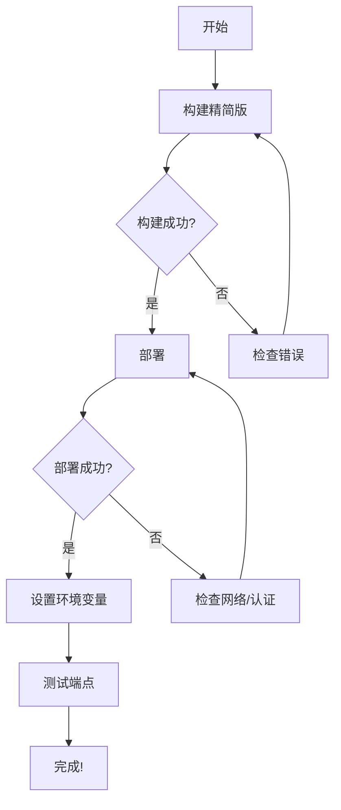

# 下一步操作

## 🎯 立即执行

由于终端遇到了一些问题，请在你的本地终端中执行以下命令：

### 1. 构建精简版 Worker

```bash
cd /Users/gjf/Desktop/project/jcyd-34/new-mastra
pnpm run build:worker
```

这将构建一个小得多的 Worker 文件（约 200-300KB，而不是 6.9MB）

### 2. 检查构建结果

```bash
ls -lh dist/worker.js
```

应该显示文件大小明显减小。

### 3. 部署到 Cloudflare

```bash
pnpm run deploy:worker
```

### 4. 如果遇到 "fetch failed" 错误

尝试以下解决方案：

#### 解决方案 A: 重新认证

```bash
npx wrangler logout
npx wrangler login
pnpm run deploy:worker
```

#### 解决方案 B: 检查网络

```bash
# 测试网络连接
curl https://api.cloudflare.com/client/v4/user/tokens/verify \
  -H "Authorization: Bearer $(cat ~/.wrangler/config/default.toml | grep 'api_token' | cut -d'"' -f2)"
```

#### 解决方案 C: 使用 wrangler 直接部署

```bash
npx wrangler deploy --env production
```

### 5. 部署成功后设置环境变量

1. 访问: https://dash.cloudflare.com/
2. 进入 **Workers & Pages**
3. 选择 `mastra-agent`
4. **Settings** → **Variables**
5. 添加: `OPENAI_API_KEY = your-api-key`

## 📊 预期结果

### 构建输出应该类似：

```
> mastra-rag-chatbot@1.0.0 build:worker
> tsc && esbuild src/worker-minimal.ts --bundle --format=esm --outfile=dist/worker.js --platform=neutral --target=es2022 --minify

  dist/worker.js  250.5kb

⚡ Done in 15ms
```

### 部署输出应该类似：

```
⛅️ wrangler 4.47.0
───────────────────
Total Upload: 250.50 KiB / gzip: 80.23 KiB
Uploaded mastra-agent (1.23 sec)
Published mastra-agent (0.45 sec)
  https://mastra-agent.your-subdomain.workers.dev
Current Deployment ID: xxxxxxxx-xxxx-xxxx-xxxx-xxxxxxxxxxxx
```

## 🧪 测试部署

部署成功后，测试：

```bash
# 替换为你的 Worker URL
WORKER_URL="https://mastra-agent.your-subdomain.workers.dev"

# 健康检查
curl $WORKER_URL/health

# 聊天测试
curl -X POST $WORKER_URL/api/chat \
  -H "Content-Type: application/json" \
  -d '{"query":"Hello!"}'
```

## 🔍 如果还是失败

### 查看详细错误日志

Wrangler 会告诉你日志文件位置，例如：

```
🪵 Logs were written to "/Users/gjf/Library/Preferences/.wrangler/logs/wrangler-2025-11-12_XX-XX-XX_XXX.log"
```

查看该文件：

```bash
cat /Users/gjf/Library/Preferences/.wrangler/logs/wrangler-2025-11-12_*.log | tail -50
```

### 实时查看日志

```bash
npx wrangler tail --env production
```

## 📋 完成检查清单

- [ ] 构建精简版成功（文件 < 1MB）
- [ ] 登录 Cloudflare 成功
- [ ] 部署成功
- [ ] 设置环境变量
- [ ] 测试健康检查端点
- [ ] 测试聊天端点

## 💡 提示

1. **精简版 vs 完整版**:
   - 精简版适合快速部署和免费计划
   - 完整版需要付费计划（$5/月）

2. **如果需要完整功能**:
   ```bash
   pnpm run build:worker:full
   pnpm run deploy:worker
   ```

3. **GitHub Actions 自动部署**:
   - 推送代码到 GitHub 后自动部署
   - 需要在 GitHub Secrets 中设置:
     - `CLOUDFLARE_API_TOKEN`
     - `CLOUDFLARE_ACCOUNT_ID`

## 🎯 推荐路径



---

**开始执行**: 打开终端，复制上面的命令开始部署！

